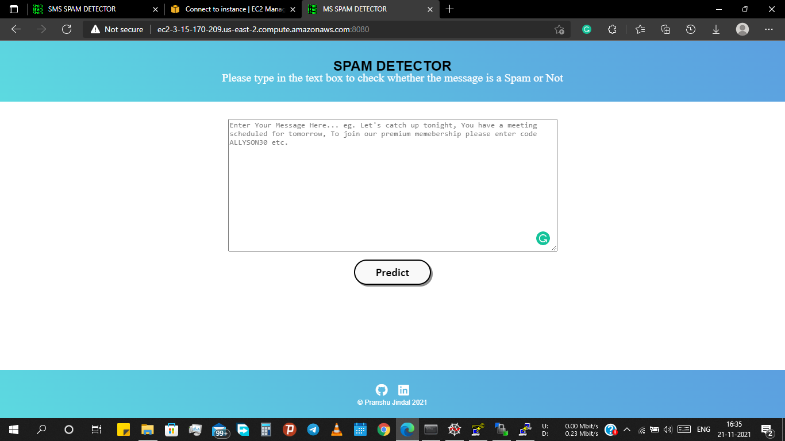
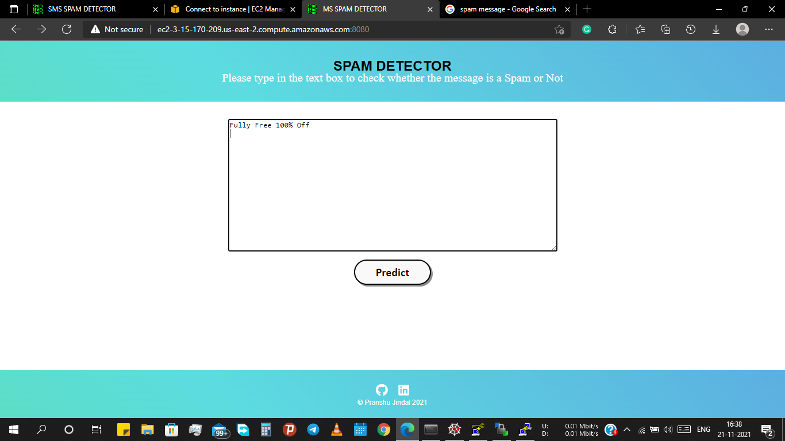
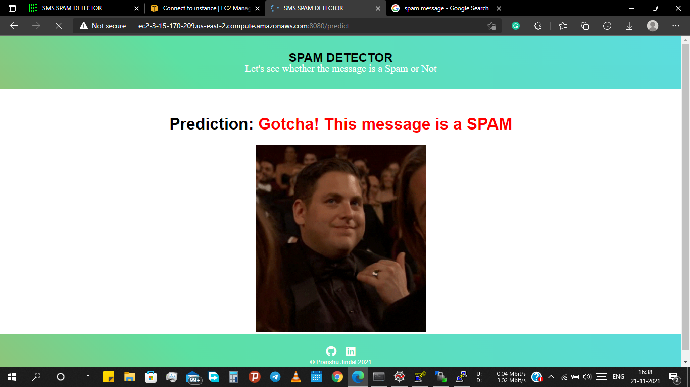
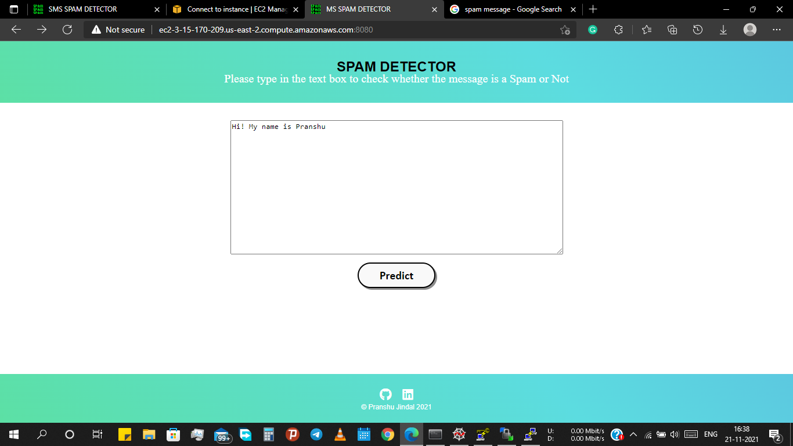
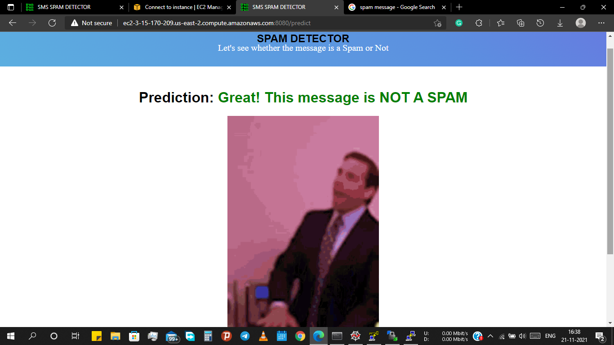

# ML-Spam-Detection-Deployment

  

This repository consists of files required for end to end implementation and deployment of Machine Learning Spam Detection web application created with flask and deployed on the  AWS EC2 Instance platform.

## Table of Contents
  * [App Link](#app-link)
  * [About the App](#about-the-app)
  * [Deployement on  AWS EC2 Instance](#deployement)
  * [Technologies Used](#technologies-used)
  * [Bug / Feature Request](#bug---feature-request)


## App Link
If you want to view the deployed model, click on the following link:<br />
[http://ec2-3-15-170-209.us-east-2.compute.amazonaws.com:8080/](http://ec2-3-15-170-209.us-east-2.compute.amazonaws.com:8080/)

A glimpse of the web app:



## About the App
The ML Spam Detection is a Flask web application which predicts whether the message is a spam or not. SMS Spam Collection dataset from Kaggle was used to classify the messages into 2 classes- Ham(1) and Spam(0) using stemming, Bag of Words model and Naive Bayes Classifiers.

Note:The dataset is an unbalanced dataset and therefore, for this situation the role of Precision becomes quite important.Precision is more focused in the positive class than in the negative class, it actually measures the probability of correct detection of positive values,

Consider the following case scenario -'suppose if the message is not a spam and if it's been predicted by the model as a spam, the consumer is going to miss that message.' So, for this type of unbalanced dataset, precision defined as {TP/(TP+FP)} plays an important role along with accuracy_score. My objective was to reduce the FP(False Positive) value as much as possible for this case and in order to overcome this issue, Naive Bayes classifiers namely, MultinomiallNB and BernoulliNB were implemented to get best accuracy_score and precision_score from the dataset.

The code is written in Python 3.6.10. If you don't have Python installed, you can find it [here](https://www.python.org/downloads/). If you are using a lower version of Python you can upgrade using the pip package, ensuring you have the latest version of pip. To install the required packages and libraries, run this command in the project directory after [cloning](https://www.howtogeek.com/451360/how-to-clone-a-github-repository/) the repository:
```bash
pip install -r requirements.txt
```

## Deployment on AWS EC2 Instance platform
Login or signup in order to create virtual app. You can either connect your github profile or download WinScp to manually to deploy this project.

[](https://heroku.com)

The next step would be to follow the instruction given in the [AWS EC2 Instance Documentation](https://docs.aws.amazon.com/codedeploy/latest/userguide/tutorials-wordpress.html) to deploy a web app.

## Technologies Used


 

 

## Input/Output ScreenShots






## Please do ⭐ the repository, if it helped you in anyway.# Spam-Detection
